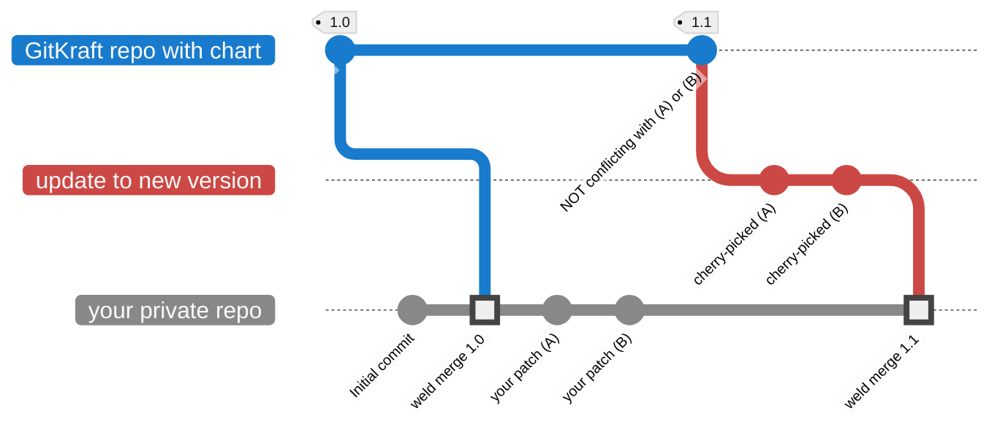
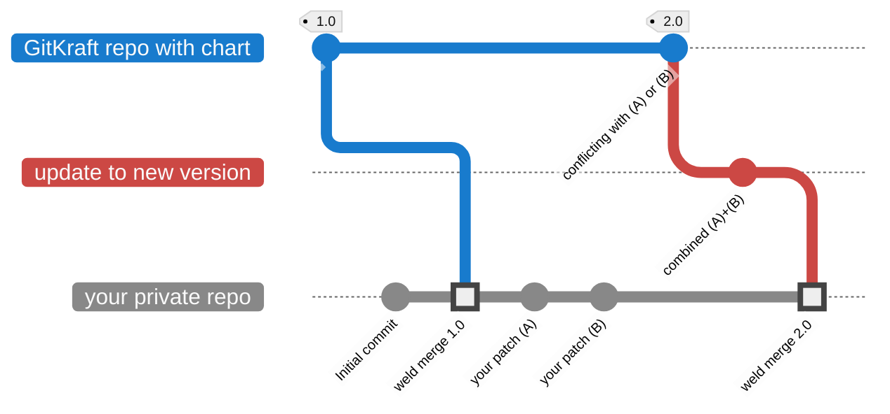

<!--
  SPDX-License-Identifier: GPL-2.0-only

  GitKraft: source code distribution and customization
  Copyright (C) 2025  GitKraft Authors

  This program is free software; you can redistribute it and/or modify
  it under the terms of the GNU General Public License version 2 as
  published by the Free Software Foundation.

  This program is distributed in the hope that it will be useful,
  but WITHOUT ANY WARRANTY; without even the implied warranty of
  MERCHANTABILITY or FITNESS FOR A PARTICULAR PURPOSE.  See the
  GNU General Public License for more details.

  You should have received a copy of the GNU General Public License along
  with this program; if not, see <https://www.gnu.org/licenses/>.
-->

# 👋 Welcome to GitKraft

GitKraft is a platform for distributing **software as source code**, combined with a patch management system designed to help end-users easily **manage and preserve their custom, source-level modifications**.

The patch management system enables users to **re-apply** their changes following **software updates**. GitKraft stores patches as Git commits and uses GitHub as its user interface. Currently, GitKraft offers more than 100 open-source Helm charts, all of which can be easily customized and maintained through patches.

## Why Choose GitKraft?

Traditional configuration files can cause unexpected issues when default values change during software updates – user-defined settings may become incompatible without warning. To address this, GitKraft replaces standard configuration files with patches. These patches explicitly capture both the original default values and the user's customizations, enabling the update system to notify users whenever underlying defaults change. 

Furthermore, large organizations often need to **adapt the source code** of vendor or community software to meet specific requirements while keeping up with the latest updates. However, GitHub has a notable limitation: a fork of a public repository must also be public, as private forks of public repositories are not supported. GitKraft bridges this gap by enabling the creation of **private forks for public repositories**.

While GitHub allows private forks when the source repository is private (with the option to later make the source repo public), this approach introduces a significant security flaw. Users from other organizations can access commits from private repositories within the same fork network, even including commits from deleted private repositories. Truffle Security has highlighted this issue[^Truffle], which poses a severe risk of exposing confidential information. GitKraft's private forks address this problem, ensuring your data remains **secure** and **isolated**.

In addition to secure forks, GitKraft offers a modern and efficient solution for **managing source-code patches**, overcoming challenges associated with traditional approaches. Current patch management methods often obscure the change history, complicating code reviews and collaboration. Some common problems include:

- **`.patch` files in Git repositories**: Storing customizations as `.patch` files feels like using one version control system inside another, making it difficult to understand changes.
- **Merge**: Merging upstream changes into a private branch buries customizations within the branch's history, making it hard to distinguish between official releases and custom modifications.
- **Rebase**: Rebasing a patch branch over upstream changes disrupts workflows for developers who have already checked out the branch, leading to errors when running `git pull`.

To address these challenges, GitKraft introduces a novel approach to patch management with a new operation called _weld merge_. This operation preserves a transparent history of changes, simplifying audits and fostering effective collaboration.

In summary, GitKraft accelerates development and update cycles, enables rapid vulnerability fixes, and maintains clear audit trails. These features empower open-source collaboration, reduce reliance on permanent forks, and streamline contributions back to the community.

## GitKraft for Open Source

A prime example of software distributed as source code is **Helm charts**, commonly used to configure services on the Kubernetes platform. End-users often need to customize Helm templates at the source level, highlighting the need for robust patch management solutions like GitKraft. To benefit the public, GitKraft distributes popular open-source Helm charts on its platform.

## Stay in Touch

**[⭐ Star the main repository](https://github.com/gitkraft/gitkraft)**.
Highly recommended, starred users may receive support priority over regular users.

**[📲 Follow me on LinkedIn](https://www.linkedin.com/in/akorzy)**.
Don't miss out on updates.

**[▶️ Watch a demo](https://www.youtube.com/watch?v=G8VT_YaDY5U)**.
See GitKraft in action.

**[✉️ Send me a free message on LinkedIn](https://www.linkedin.com/in/akorzy)**.
Interested in the project? Let me know what you need – I promise, no chatbots!

## How to Use GitKraft

To create a private fork of an open-source Helm chart provided by GitKraft, follow these steps:

| Step No. | Instructions | Screenshot |
|----------|----------|--|
| 1    | Browse the available repositories in the [**gitkraft** organization on GitHub](https://github.com/orgs/gitkraft/repositories?q=sort%3Aname-asc+topic%3Ahelm-chart). Click on the repository containing the chart you require.||
| 2    | Scroll down to the README file. Click on the green **Private Fork** button. ||
| 3    | Choose your organization for the private fork, then click **Create repository**. ||
| 4    | A GitHub workflow has now started in the background and will populate the repository with contents. You can click on the green **Watch progress** button, or wait and refresh the page after a couple of minutes.||
| 5    | Once the repository is ready, commit your customizations to the `main` branch as needed. ||
| 6    | When a new community version is released, click on the **Update** button in the README file, which will take you to a page where you can trigger an update. ||
| 7    | Click on the dark grey dropdown box **Run workflow** and then on the green **Run workflow** button to import the latest release while preserving your source-level customizations. Optionally, you can also type in another release to import, rather than the latest one – such as an older version to roll back to.||
| 8a   | If there are no conflicts, the workflow completes successfully, merging your customizations with the update. ||
| 8b   | If conflicts occur, the workflow provides a button to resolve it and proceed with the update by creating a pull request and accessing the conflict resolution interface. ||

## How GitKraft Works

Clicking on the **Private Fork** button takes the user to a GitHub web form that allows them to create a new private repository in the GitHub organization of their choice. Importantly, certain options in the form will be pre-selected, such as the so-called template repository, which points to a special repository provided by GitKraft. When the user creates their new private repository, its contents will be copied from the GitKraft's template repository. Those contents include a GitHub workflow, which will run immediately after the repository is created. The workflow will download the software the user wanted to fork and merge it into the `main` branch.

During updates, the _GitKraft: Update_ workflow cherry-picks your custom patches on top of the latest release from upstream. It then performs a special merge, known as a _weld merge_, which attaches the patched release to `main` in your private repository.

If all customizations cherry-pick successfully, the workflow completes as follows:

If conflicts occur, temporary branches `gitkraft/update` and `gitkraft/main` are created, and a link to a pull request (PR) is generated for conflict resolution. Once the user resolves and merges, the _GitKraft: finalize conflict resolution_ workflow updates `main` using the conflict resolution from `gitkraft/main`. Note that due to GitHub’s conflict resolution process, all patches will combine into one commit (a future improvement may address this). The final `main` branch in your private repo looks like this:

## Legal

GitKraft was created by Aleksander Korzyński and is maintained by KZS Commerce Ltd,
a company registered in England and Wales under company number 12242538,
with its registered office at:
Office 315B, 182-184 High St. North, London, E6 2JA, United Kingdom.

[^Truffle]: [Anyone can Access Deleted and Private Repository Data on GitHub](https://trufflesecurity.com/blog/anyone-can-access-deleted-and-private-repo-data-github), Truffle Security, July 24, 2024
