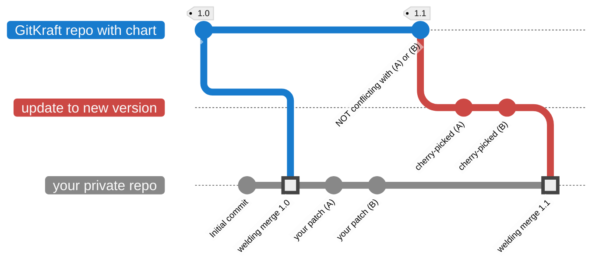
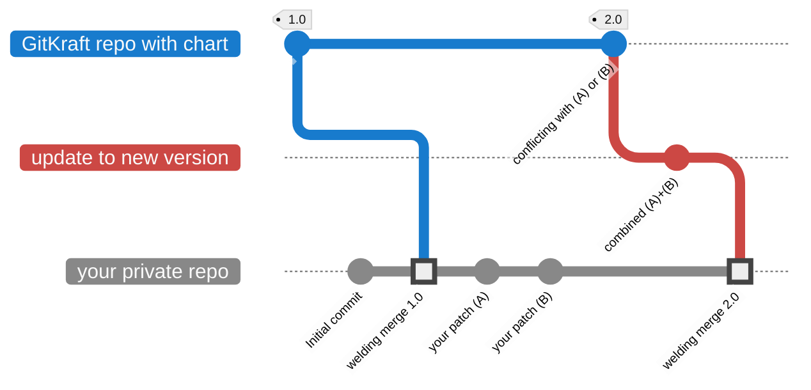

# 👋 Welcome to GitKraft

GitKraft is a platform for distributing **software as source code** on GitHub, uniquely designed to empower end-users to **easily manage and retain custom, source-level modifications** of the software.

With GitKraft's **GitHub extensions**, users can create **private forks** of software, **customize its source code**, and **update** the software to the latest vendor or community release—all **without losing customizations**.

## Why Choose GitKraft?

Large organizations often need to **adapt vendor or community software** to meet specific requirements while keeping up with the latest updates. GitKraft provides a modern, efficient toolset for **managing source-code patches**, overcoming the limitations of traditional methods that can lead to delays and security risks. By integrating patch management into the Git version control system, GitKraft **accelerates development and update cycles**, enables rapid vulnerability fixes, and maintains **clear audit trails**. It also fosters open-source collaboration, reducing the need for forks and simplifying contributions back to the community.

An example of software distributed as source code is Helm charts (used for configuring services on the Kubernetes platform). End-users often need to customize Helm charts at the source level, highlighting the need for patch management solutions like GitKraft.

## GitKraft for Open Source

To benefit the public, GitKraft will distribute popular open-source projects on its platform. Initially, all distributed projects will be Helm charts. This initiative is currently in progress. Stay tuned for updates.

## Stay in Touch

**[⭐ Star this project](https://github.com/gitkraft/gitkraft)**. Highly recommended, starred users may receive support priority over regular users.

**[📲 Follow me on LinkedIn](https://www.linkedin.com/in/akorzy)**. Don't miss out on updates.

**[✉️ Send me a free message on LinkedIn](https://www.linkedin.com/in/akorzy)**. If you're interested in this project, tell me what you need! I promise – no chatbot!

## How to Use GitKraft

When GitKraft is released you'll be able to use it as follows.

| Step No. | Instructions | Screenshot |
|----------|----------|--|
| 1    | Browse the available repositories in the gitkraft organization on GitHub. Click on the repository containing the chart you require.||
| 2    | Scroll down to the README file. Click on the green **Private Fork** button. ||
| 3    | Choose your organization for the private fork, then click **Create repository**. ||
| 4    | A GitHub workflow has now started in the background and will populate the repository with contents. You can click on the green **Watch progress** button, or wait and refresh the page after a couple of minutes.||
| 5    | Once the repository is ready, commit your customizations to the `main` branch as needed. ||
| 6    | When a new community version is released, click on the **Update** button in the README file, which will take you to a page where you can trigger an update. ||
| 7    | Click on the dark grey dropdown box **Run workflow** and then on the green **Run workflow** button to import the latest release while preserving your source-level customizations. Optionally, you can also type in another release to import, rather than the latest one – such as an older version to roll back to.||
| 8a   | If there are no conflicts, the workflow completes successfully, merging your customizations with the update. ||
| 8b   | If conflicts occur, the workflow provides a button to resolve it and proceed with the update by creating a pull request and accessing the conflict resolution interface. ||

## How GitKraft Works

Selecting **Private Fork** creates a repository based on a GitKraft template. This template uses a GitHub Workflow to download the chart and its dependencies, merging them into `main`.

During updates, the _GitKraft: Update_ workflow cherry-picks your custom patches on top of the latest release from upstream. It then performs a special merge, known as a _welding merge_, which attaches the patched release to `main` in your private repository.

If all customizations cherry-pick successfully, the workflow completes as follows:

If conflicts occur, temporary branches `gitkraft/update` and `gitkraft/main` are created, and a link to a pull request (PR) is generated for conflict resolution. Once the user resolves and merges, the _GitKraft: finalize conflict resolution_ workflow updates `main` using the conflict resolution from `gitkraft/main`. Note that due to GitHub’s conflict resolution process, all patches will combine into one commit (a future improvement may address this). The final `main` branch in your private repo looks like this:

